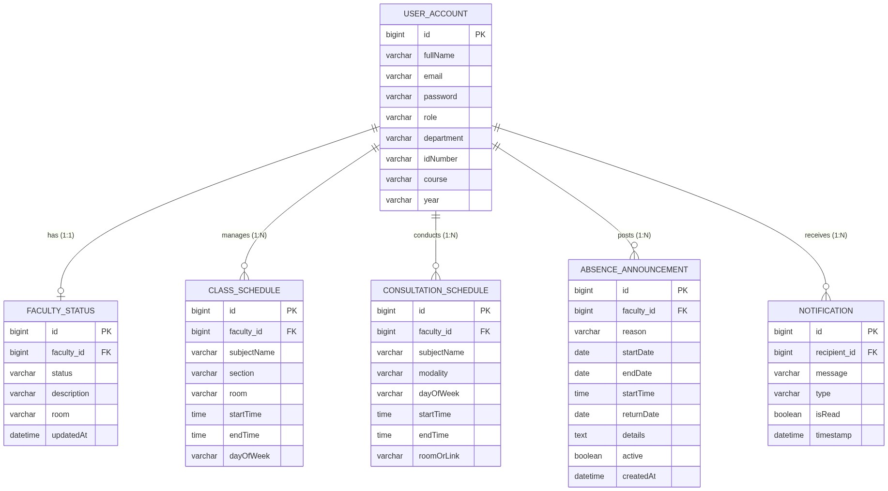
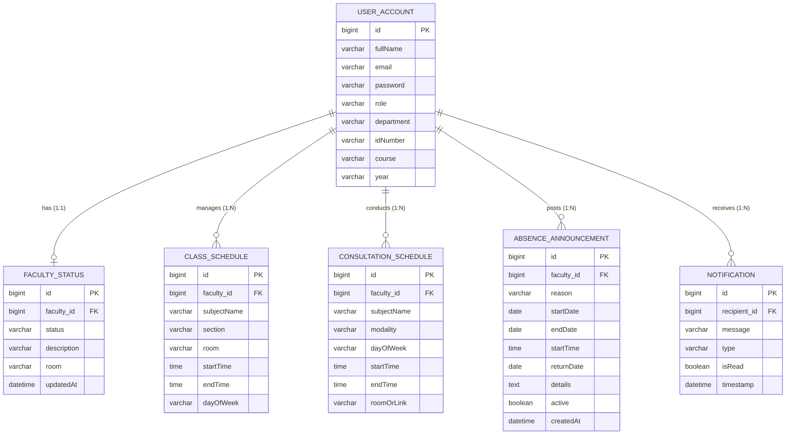
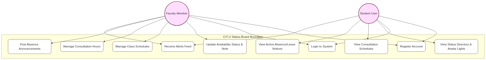
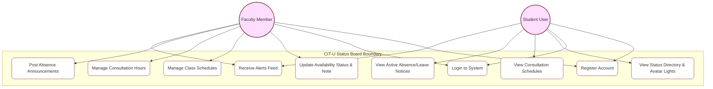
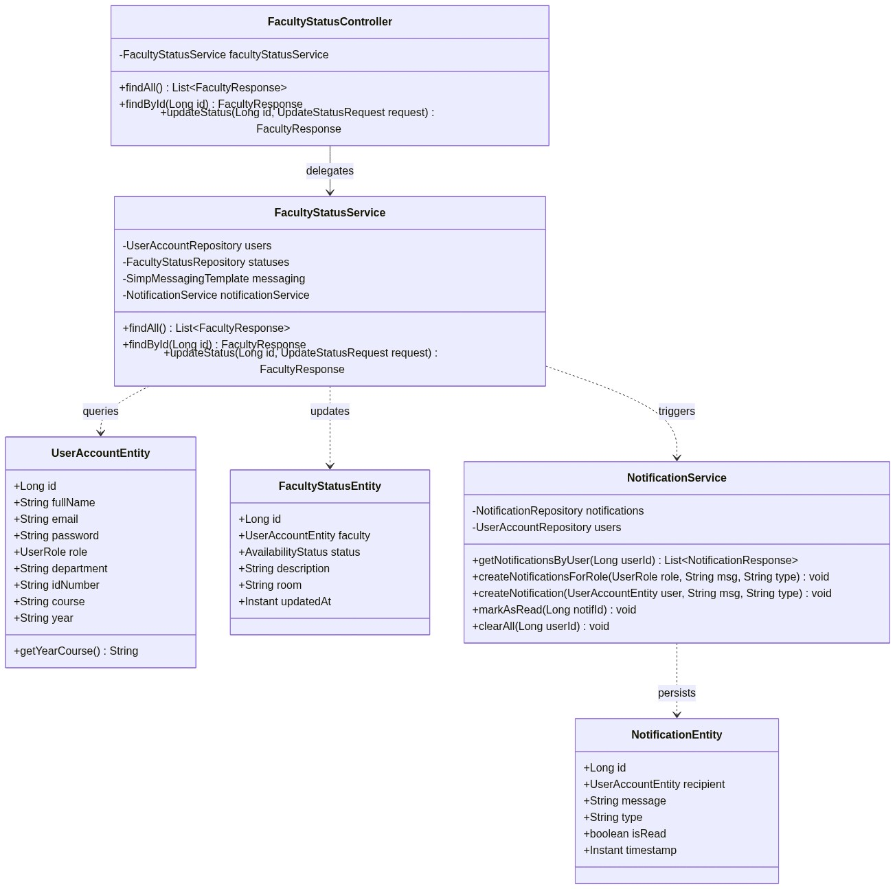
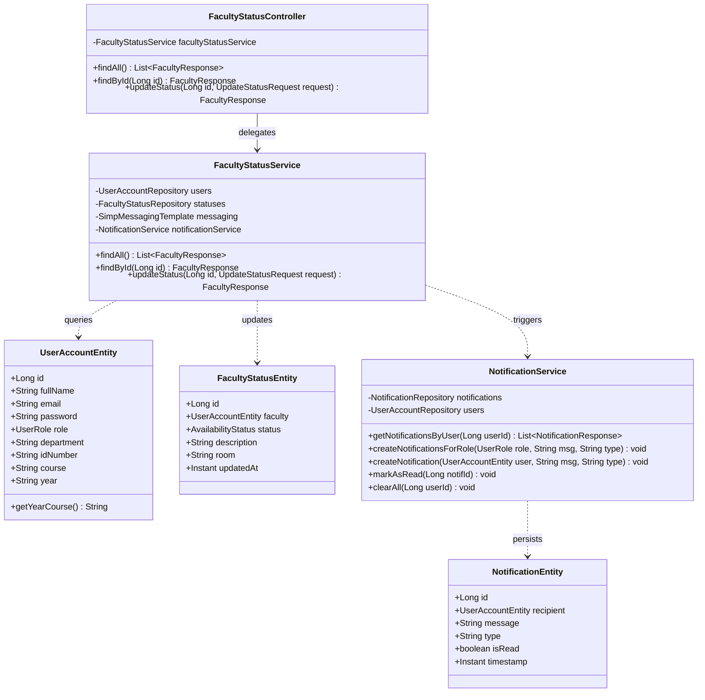
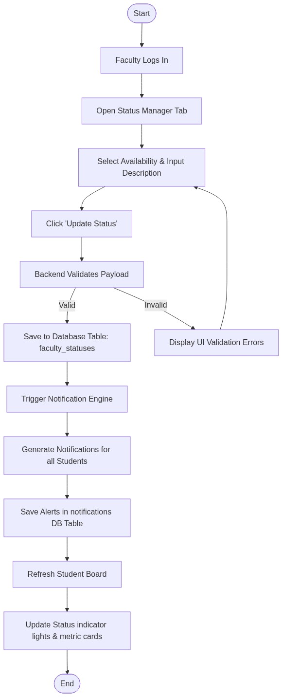
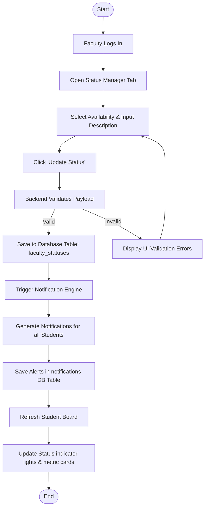
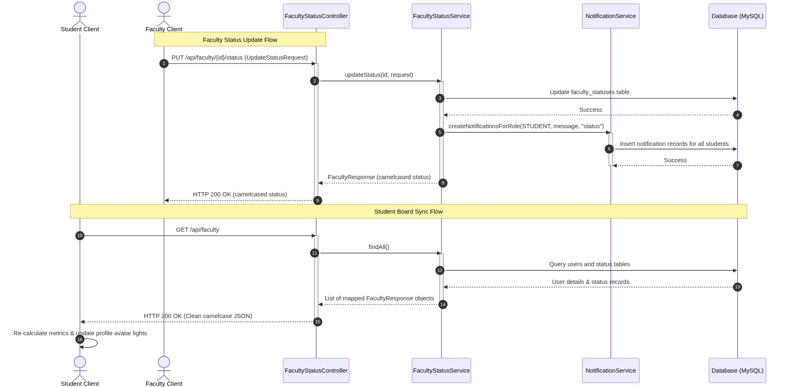
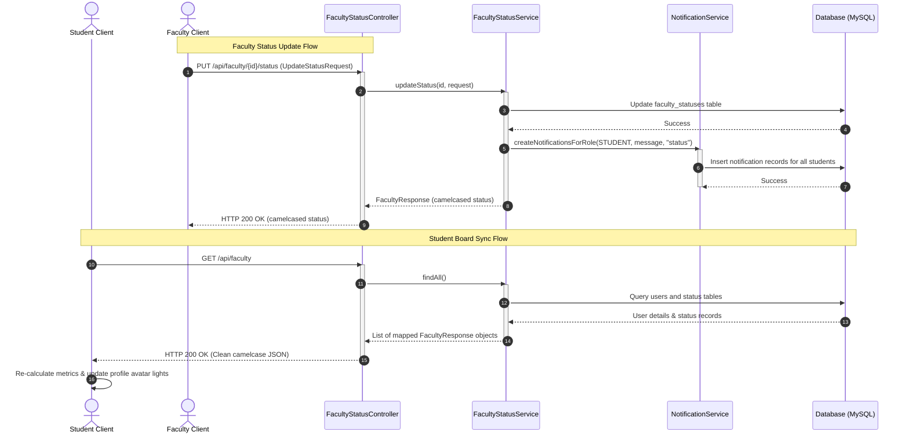

# CIT-U Faculty Status Board
## System Architecture & Project Documentation

### Group Members:
*   **Vince Raymund J. Alerta**
*   **Jehryn D. Laurino**
*   **Nicco Victor P. Maldo**

**Course Code:** CSIT321 - Applications Development and Emerging Technologies  
**Project Title:** CIT-U Faculty Status Board

---

## 1. Entity Relationship Diagram (ERD)
The ERD maps out the structural data model of the application, representing database persistence relationships between user accounts, real-time statuses, schedules, absence logs, and notification feeds.

💻 View Mermaid Source Code

---

## 2. Use Case Diagram
This diagram outlines the interactions between the two primary Actors (Faculty and Student) and the key behaviors supported by the system.

💻 View Mermaid Source Code

---

## 3. Class Diagram
The Class Diagram models the technical composition of the Spring Boot backend layer, showcasing relationships between entities, service handlers, repository queries, and REST controllers.

💻 View Mermaid Source Code

---

## 4. Activity Diagram
This workflow maps the sequence of actions and state decisions when a Faculty member updates their availability status.

💻 View Mermaid Source Code

---

## 5. Sequence Diagram
This displays the sequential flow of messages between system actors and technical components during a status update and subsequent student directory sync.

💻 View Mermaid Source Code

